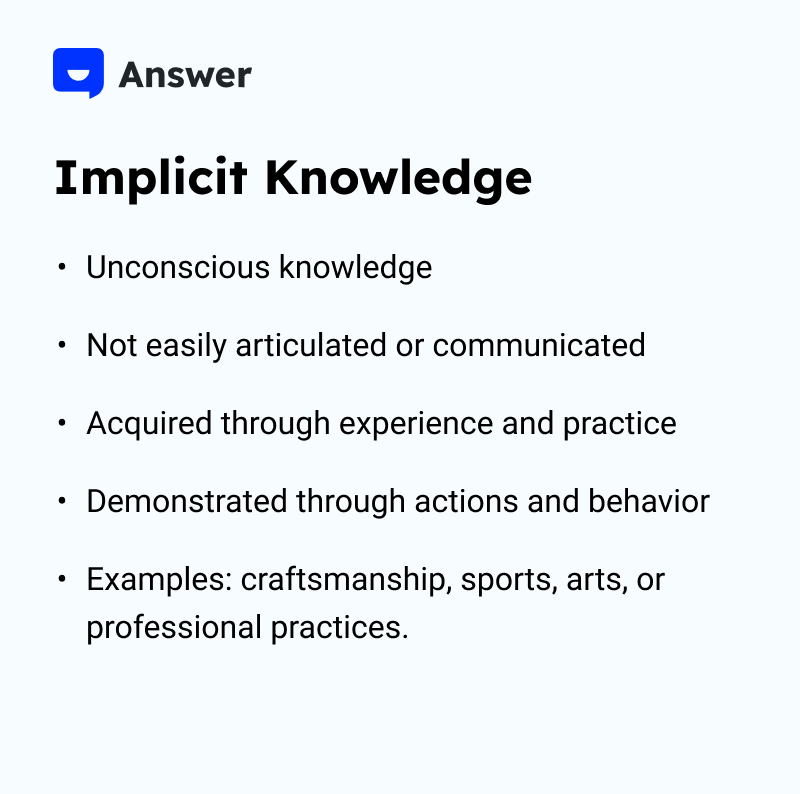
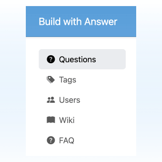

Knowledge sharing refers to the process of exchanging information, insights, experiences, and expertise among individuals or groups within an organization or community.  Effective knowledge sharing increases productivity, and enhances collaboration within your team.

Answer was inspired by the inherent openness of Q&A platforms and communities. As the team behind Answer, we appreciate and embody the spirit of knowledge sharing when tuning Answer.

In this blog, we will explore types of knowledge, ways of knowledge sharing, and strategies to improve knowledge sharing for your team with Answer.

## What is Knowledge Sharing?

[Knowledge Sharing Comic by Dilbert](https://en.wikipedia.org/wiki/Knowledge_sharing)is an activity through which knowledge (namely, information, skills, or expertise) is exchanged among people, friends, peers, families, communities, or within or between organizations.

Answer is a platform for knowledge sharing, and the form of asking and answering is a natural way of knowledge sharing. The information in Answer can be documented for every user to check. Admins can modify them for keeping them up-to-date.

## 3 Types and Ways of Knowledge Sharing

01. Explicit Knowledge
 Also known as expressive knowledge. It is the knowledge that can be formalized, easily articulated, and can be written down or shared in documents and manuals. Explicit knowledge includes: user manuals, case studies, SOPs, etc.
 Explicit knowledge is absolute and ready for sharing so that you can share it with confidence.
   

02. Implicit Knowledge
 The knowledge is developed through years of practice, observation, and experience. It is commonly associated with skills, expertise, and "know-how" in various domains, such as craftsmanship, sports, arts, or professional practices.
 Implicit knowledge sharing is diverse, since everyone has different approaches to solve the same problem or achieve the same goal.
    

03. Tacit Knowledge
 Tacit knowledge is gained through experience and practice, which makes it hard to articulate or transfer explicitly. It is personal, subjective, and hard to put into words.
 Tacit knowledge sharing is through direct interactions, observation, and mentorship.
   

## Effective Knowledge Sharing with Answer

No matter which type of knowledge your company or team has, it never goes wrong to capture, store and share them effectively for everyone on the team.

Effective knowledge sharing involves sharing information, expertise, and insights. It requires creating a culture that values collaboration and providing tools for easy exchange of knowledge. Here’s how Answer helps for effective knowledge sharing.

1. Open and Collaborative Culture
 Encourage and value knowledge sharing for everyone on the team. The essence of Answer is open source, and the Q&A platform itself is open and collaborative.
 In Answer, you can customize the layout and add rules in the sidebar to remind everyone subtly.
 
 You can also pin the welcome post that includes regulations, values, and spirit of your platform, ensuring new members can see the post as soon as they join your community, while helping community members to check.
 
  
2. Make Knowledge Accessible
 In Answer, sharing and accessing to knowledge is like breathing. Everyone is a loop of knowledge sharing: add a question, provide answer, upvote, etc. This fosters a collaborative spirit for the community naturally.
 

 Admin can also add wikis, FAQ for users in the sidebar to provide relevant knowledge.
 

3. Effective Knowledge Management  
 Besides knowledge storage, and creation, knowledge management is the key that keeps your platform running. In Answer, you can manage different types of knowledge by tags. You can find tags are like troops, guarding each question so that you can identify the category you need immediately.
 
 Managing tags is also easy. Admins can add, edit or remove a tag in one place.
 
4. Recognition and Rewards
 Express gratitude to the contributors and experts.
 In Answer, we’ve automated the [reputation system](https://answer.apache.org/docs/recipes/contents/reputation), encouraging ownership and motivation to share valuable insights. Users can earn reputation scores by asking questions that everyone concerns, receiving votes from other users, answers accepted. It’s a reflection of how active you are in the community. With more reputation scores, you’ll unlock more features, such as upvote, invite an answer, edit other’s question, etc.

5. Feedback and Evaluation  
 Encouraging feedback loops and continuous improvement for your community. Once you've obtained a sufficient reputation score, you can start voting for questions or answers, providing feedback to enhance its quality and relevance.

## Conclusion

Understand three types of knowledge and find an effective way to share in the team. Answer is always here to help. Discover a new era of knowledge sharing with Answer, and there are more features waiting for you. By harnessing the power of this dynamic Q&A platform, you can unlock exchange expertise, foster collaboration, and sharing knowledge effectively like never before.

Let’s [get started](https://answer.apache.org/docs).
