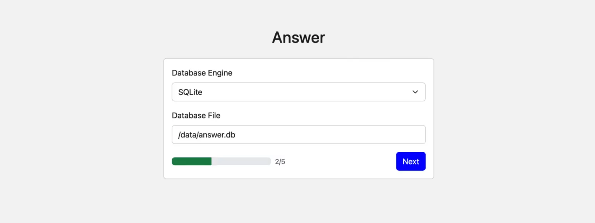
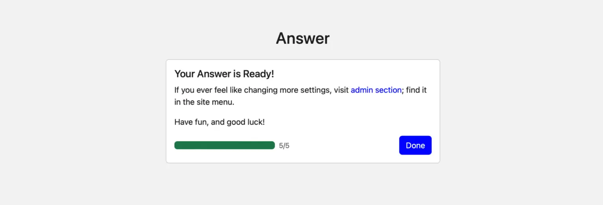

## What is Apache Answer?

Apache Answer is a Q&A platform that helps teams build communities and share knowledge. It can be used as a help center, community forum, or knowledge management platform. Apache Answer is open source and incubates at [Apache Incubator](https://incubator.apache.org/).

## Prerequisites

This guide assumes the following prerequisites are met:

- [Ubuntu Focal 20.04 (LTS)](https://blog.radwebhosting.com/ubuntu-20-04-lts-focal-fossa-available-kvm-vps/) or [Ubuntu Jammy 22.04 (LTS)](https://blog.radwebhosting.com/ubuntu-22-04-lts-jammy-jellyfish-template-added-for-kvm-vps-servers/) fresh install
- Root-level user access

## Install and Run Apache Answer on Ubuntu VPS

To install and run Apache Answer on Ubuntu VPS, follow the steps below:

1. ### **Install Docker Engine**

    1. [Login via SSH as root user](https://radwebhosting.com/client_area/knowledgebase/30/How-to-SSH-a-Virtual-or-Dedicated-Server-Linux.html).
    2. Update and upgrade system:

        ```shell-session
        sudo apt-get update -y && sudo apt-get upgrade -y
        ```

    3. Remove existing Docker files by running the following command:

        ```shell-session
        for pkg in docker.io docker-doc docker-compose docker-compose-v2 podman-docker containerd runc; do sudo apt-get remove $pkg; done
        ```

    4. Install Docker Engine latest version with:

        ```shell-session
        curl -fsSL https://get.docker.com -o get-docker.sh
        sudo sh get-docker.sh
        ```

2. ### **Install Docker Compose**

    1. Run the following command:

        ```shell-session
        sudo apt-get install docker-compose-plugin
        ```

    2. Verify that Docker Compose is installed correctly by checking the version:

        ```shell-session
        docker compose version
        ```

3. ### **Install Apache Answer**

    1. Start Apache Answer with Docker Compose:

        ```shell-session
        curl -fsSL https://raw.githubusercontent.com/apache/answer/main/docker-compose.yaml | docker compose -p answer -f - up
        ```

       The default port for Answer is 9080. You can access it at http://localhost:9080.

    2. Install steps  
       After you start the answer, you can follow the steps below to complete the initialization about the basic configuration.
        1. Choose the language
        2. Config database  
           Answer supports [MySQL](https://www.mysql.com/), [PostgreSQL](https://www.postgresql.org/), and [SQLite](https://www.sqlite.org/) as the database backend. The smallest environment is SQLite, which does not require any additional configuration. If you want to use MySQL or PostgreSQL, you need to setup the database first and then configure the database connection in this step. Here we recommend using sqlite3 to complete your first experience.
        3. Create configuration file  
           Click Next button to create the configuration file.
        4. Fill in basic information  
           “Site URL” is the browser address you will use to access answers after installation.  
           Don’t forget the admin Email and password.
        5. Complete  
           Congratulations, you can click the done button to start your answer journey!

[See also How to Migrate from SiteGround to Rad Web Hosting](https://blog.radwebhosting.com/how-to-migrate-from-siteground-to-rad-web-hosting/)

## Conclusion

You now know how to install and run Apache Answer on Ubuntu VPS server.

:::note

Originally published at https://blog.radwebhosting.com/install-and-run-apache-answer-on-ubuntu-vps/ on MAY 31, 2024

:::
