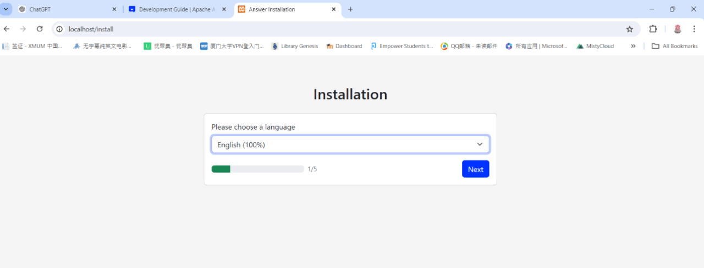
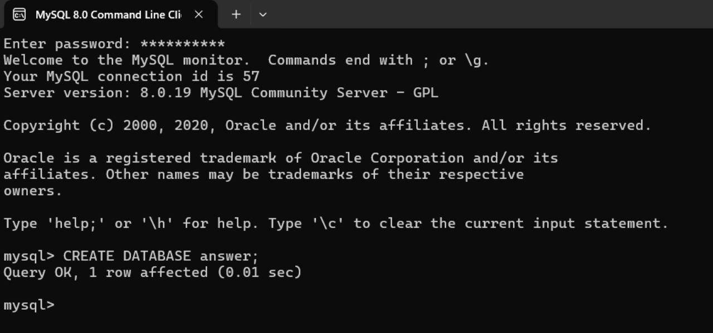
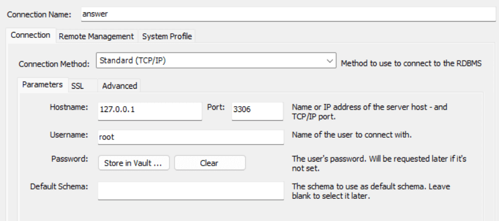
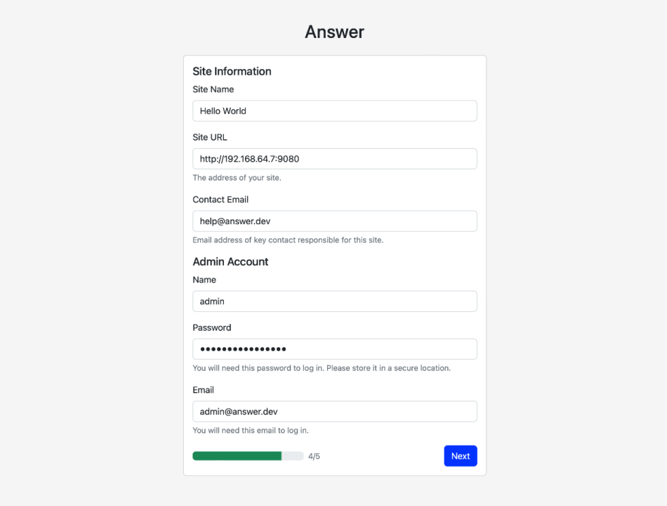
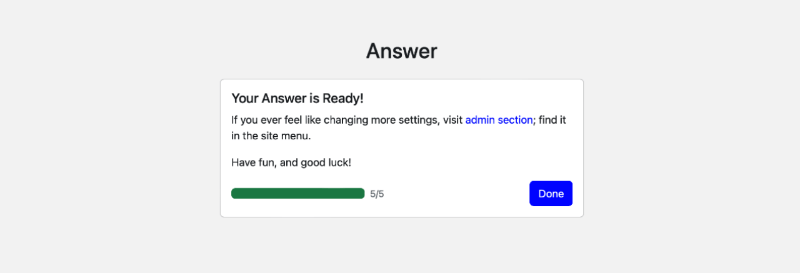
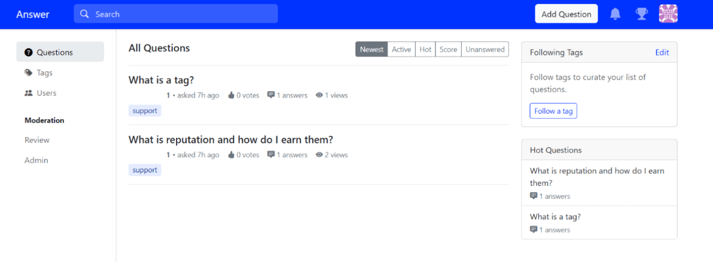

在 [Apache Answer 前端配置指南](https://answer.apache.org/zh-CN/blog/apache-answer-frontend-configuration-guide)中，相信大家都能跟随每一步完成前端配置。本文将详细指导你如何配置 Apache Answer 的后端，我们将一步一步地进行讲解，确保每个人都能上手并成功运行。

## 准备工作

1. 下载 Golang
    从[官方网站](https://go.dev/doc/install)下载并安装 Go 语言, 按默认设置安装即可。

2. Clone Answer 项目
    确保你已经克隆了 Apache Answer 到本地，如还未克隆，请阅读 [Apache Answer 前端配置指南](https://answer.apache.org/zh-CN/blog/apache-answer-frontend-configuration-guide)。


## 一、初始化项目

在 Answer 项目根目录打开`命令行终端`运行以下命令。
```
go mod download
go run cmd/answer/main.go init -C ./answer-data
```
_注：如果第一条跑不出来可先跑第二条，运行时间可能较长，请耐心等待。_


看到 `[SUCCESS]` 即运行成功，**注意此时不要关闭该程序**。在网页输入所提示的网址：`http://localhost:80/install/`，打开并进行下一步安装。

_注：如果打开网址找不到此localhost页面，尝试先运行以下命令再重试_
```
cd ./ui
pnpm pre-install
pnpm install
pnpm build
cd ..
```


## 二、安装界面

打开 `http://localhost:80/install/` 将看到以下界面，第一步选择语言。


### 2.1 配置数据库

你可以使用自己的数据库软件创建 Answer 数据库
Apache Answer 支持 MySQL、PostgreSQL 和 SQLite 作为数据库后端。环境最小的是 SQLite，不需要任何额外配置。
如果要使用 MySQL 或 PostgreSQL，则需要**先设置数据库**，然后在此步骤中配置数据库连接。


**本文将以 MySQL 为例进行说明。**

#### 创建数据库

在`MySQL 命令行`中创建一个名为 answer 的数据库：


#### 配置数据库连接

访问 `http://localhost:80/install/`，在安装界面中输入你的数据库连接信息：
- User name: root
- Database host: 127.0.0.1:3306
- Password: 你的数据库密码


### 2.2 创建配置文件

在安装界面中，按照提示创建 `config.yaml` 文件。


### 2.3 设置网页信息和管理员账号

请记住网站URL（如`http://localhost`）以及管理员账号信息密码，方便后续登陆。


### 2.4 完成安装



## 三、运行后端

回到`命令行终端`，在answer项目根目录运行以下命令启动后端服务器 。
```
go run cmd/answer/main.go run -C ./answer-data
```


## 四、验证安装

在浏览器中访问你设置的网站 URL（例如：`http://localhost`），登陆你的管理员账号，如果看到一下页面，即配置成功。



通过以上步骤，你已经成功培植了 Apache Answer 后端。如果遇到其他问题，欢迎你在[社区](https://meta.answer.dev/)中和我们的社区成员进行沟通。我们也非常欢迎你参与到[社区贡献](https://answer.apache.org/zh-CN/community/contributing/)中来，为打造更好的问答平台，一同努力。
