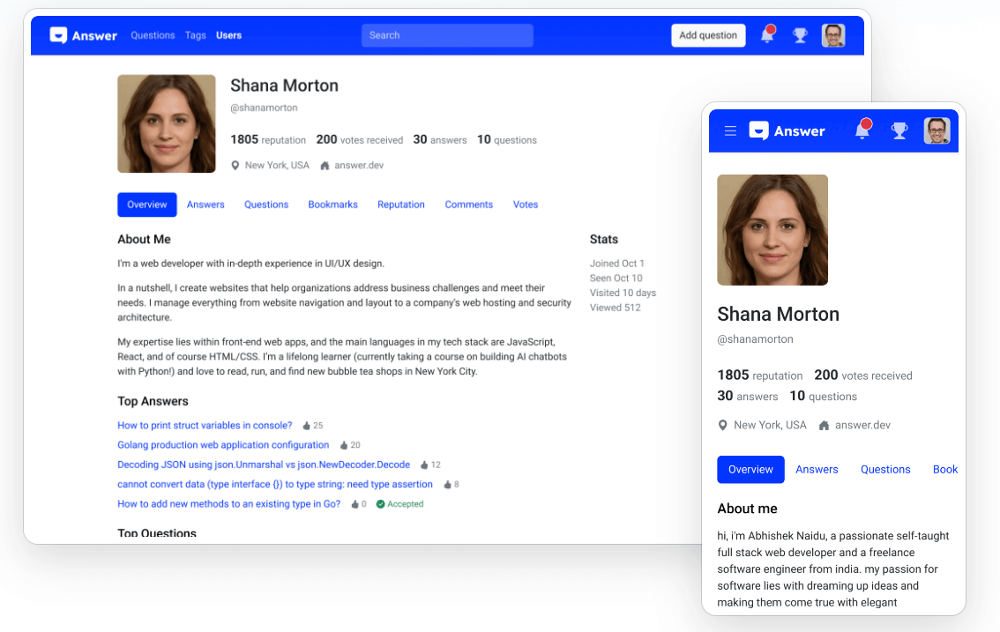
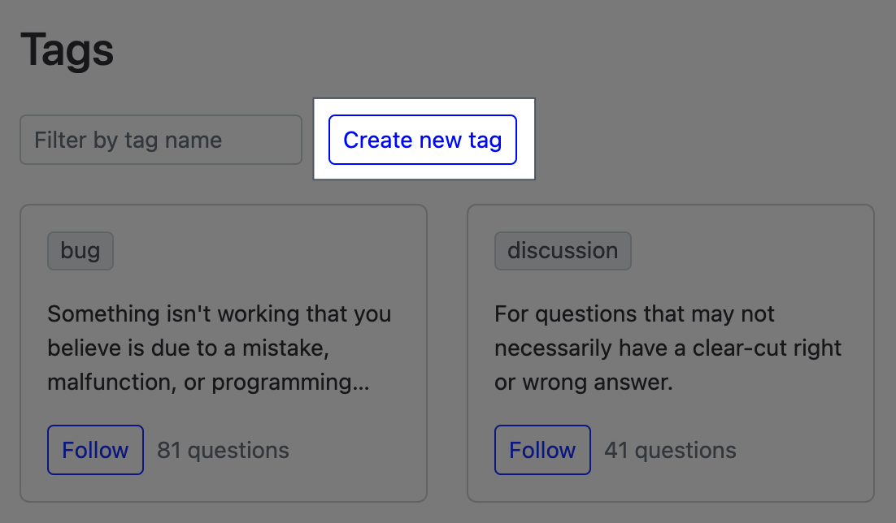

This is an overwhelming world, where an answer is available at a snap, a click, and a blink. With data and information flowing ceaselessly around us, the challenge today is not accessing knowledge but retaining it. 

We’ve stepped into the world of Q&A platform, and let’s dive in to tackle this challenge together. 

In this article, we will figure out what is knowledge retention for both individuals and businesses, understand why it’s important, strategies that help you to prevent the collective wisdom of your business, and how Answer can help you with this.

## What is Knowledge Retention

 [Memory is an ongoing process of information retention over time](https://bokcenter.harvard.edu/how-memory-works), so for individuals, knowledge retention is to capture, remember and retrieve critical information. As for business, knowledge retention involves capturing, storing, preserving, and sharing knowledge within an organization. 

Photo by [Scott Graham](https://unsplash.com/@homajob?utm_source=unsplash&utm_medium=referral&utm_content=creditCopyText) on [Unsplash](https://unsplash.com/photos/5fNmWej4tAA?utm_source=unsplash&utm_medium=referral&utm_content=creditCopyText)

## Why it is Important 

For individuals, knowledge retention reflects one’s learning ability because you’ve retained the knowledge in your long-term memory. The ability to retrieve information is essential for one’s continued personal growth, career advancement, and professional success, etc. 

When it comes to business, knowledge isn’t merely about internal data or information, **it’s the experience or expertise of an employee or a team, **such as, best practice, customer data, operation procedure, etc. In this case, knowledge retention refers to:
1. Core knowledge stays in the organization
2. Employee can always access the right knowledge 
3. Retain and transfer for the future

Knowledge retention is crucial to helping companies run efficiently and maintain a competitive edge, and it has become a core to maintain sustain growth.

Photo by [Annie Spratt](https://unsplash.com/@anniespratt?utm_source=unsplash&utm_medium=referral&utm_content=creditCopyText) on [Unsplash](https://unsplash.com/photos/QckxruozjRg?utm_source=unsplash&utm_medium=referral&utm_content=creditCopyText)

## Effective Knowledge Retention Strategies

With the significance of knowledge retention in mind, how can companies and teams make effective knowledge retention? 

### Build a Knowledge Sharing Platforms

To make knowledge sharing and access easier within the organization, set up platforms and tools that facilitate the process. This can be achieved through the use of intranets, collaboration software, or knowledge management systems. 

Answer is an [open-source Q&A platform](https://github.com/apache/answer), which gives companies freedom to build a knowledge-based community in the way they need. No matter it’s for products, customer support, or the team, Answer is capable of making it happen on different devices.

### Identify and Prioritize the Knowledge 

Obviously, it’s impossible to retain all the information, since there are different roles and departments in a company, and each plays a different role in the business. 

Identify the secret weapon for your business, and prioritize the key information, skills, and expertise that are most critical to the success of your business. 

Tags help users identify the knowledge they require at the moment. In [Answer](https://meta.answer.dev/questions/D1V8/how-to-create-some-tags-without-add-question), admins can create a new tag without adding a question. This is helpful to preparing the foundation of a knowledge base.

You can also Pin the most important knowledge to make sure everyone can access it in the first place.

### Encourage Knowledge Sharing with Award
Create a pleasant, easy-to-share process for everyone and keep sharing going with awards. Encourage employees with expertise to contribute with an internal reward system, which is similar to the achievement system of games. It adds a sense of competition as well as fun, which makes sharing more engaging.   

Stay tuned for Answer’s coming reward system, we promise it will make knowledge sharing exciting.

### Keep Knowledge Staying Alive
The core knowledge is ready, and the award system for enthusiasms with expertise is on board, now what? Keep the documents always up-to-date.

Knowledge sharing is not a one-time event, it’s a sustainable process. Like a company, it develops into different phrases, and so is the knowledge. Regular reviews and modifications ensure the documents or information is up-to-date, relevant, and effective.  

In Answer, you can use Unlist to prevent temporary access to a question. This allows admins or moderators to review, edit, or remove out-dated resources regularly. 

## Ready to Grow Your Business with Answer?
After reading the post, you must be aware of the significance of knowledge retention for both individuals and businesses. Let Answer be your company so that you can kick-start building a smooth knowledge sharing process for everyone, and every scenario. 

Join [our community](https://meta.answer.dev/) where you can ask and get assistance easily, follow our social media for the latest updates and up-to-date tips and tricks, even better, become a contributor and ignite knowledge sharing for the world. 
