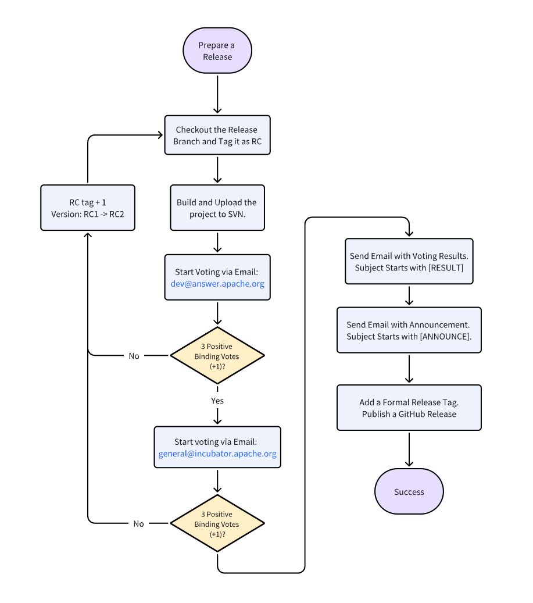

Answer joined the [Apache Incubator](https://answer.apache.org/blog/answer-enters-apache-incubator) last October, and we've already released 3 Apache versions so far. From overwhelming during our first release, we are now out of the woods.

Speaking of releases, we can’t neglect Release Manager. The person who makes sure that everything is compliant and everyone can access to the latest version. We talked to LinkinStars, the conductor behind each Apache Answer release. Let's see how he sees this role, how he handles obstacles, and his secrets to a smooth release.

## Tell us a bit about yourself
I am the backend developer for Apache Answer. My daily routine includes developing the backend services of Answer, developing APIs, etc. I like coding, reading, and learning English. My tech stack is mainly Go, and my favorite open-source project is Kubernetes.

## What makes you the release manager of Apache Answer, and what do you think of this role?
Usually, a backend engineer is responsible for the compilation, packaging, and deployment of the project. That’s why I am here. 

This role itself requires lots of patience and carefulness. Each package needs to be carefully checked to ensure that all the required files are correct and compliant. Release managers have a lot on their plate, since the releasing problems will lead to user upgrade or usage issues.

## Can you briefly walk us through the release process? Which stages are more critical?
Sure. The release process of Apache Answer consists of the following stages.

The most important stage is actually the **preparation**. It involves preparation and review of all the content that needs to be released. We have to check and review the open-source requirements, license, signature, etc. If this stage is not well checked, we cannot pass the voting afterward.

## Which tools/platforms do you use to release?
We use GitHub Actions to build the packages and release.

## What are the key factors for a successful release?
The 2 key factors for a successful release are:

**Check once, check twice, and check from the top again.**
**Test, test again, and another round of tests.**

No worries, as soon as you have released the first Apache version, things get easier and smoother. 

## How do you prioritize the tasks in the release process?
Handling multiple tasks happens occasionally, and here’s how I manage them.

Once we decide to release the version, and there might still be new issues coming from the users. In this case, if there’s no urgent bugs that need to be fixed, we will put them into the to-dos of the next version and move on. 

## How do you handle "unexpected events" during the release process?
Seek help from the mentors.        
I will ask them to locate the problem and help with the review. Then, we will fix it, and re-initiate the voting. 

## Can you share one of the most difficult challenges you faced during the release process, and how did you nail it?
The most enduring challenge I faced was the first release. I had no idea about preparation, what to expect, and what’s next. Here’s how I manage to overcome the challenges with the team.
1. Collect and organize all the documents related to Apache releases.
2. Look into the release notes and emails of other Apache projects for reference.
3. Seek help from the mentors via emails.

The most important thing is to **keep trying**. The Apache community is friendly, and community members will remind you with assistance. Be brave, and embrace the mistakes. 

*Find out how we launched the first Apache Release [here](https://answer.apache.org/blog/behind-the-scene-how-we-launched-the-first-apache-release).*

## What are some strategies/tips you have for working effectively with your team during the release process?
1. Use GitHub issues and projects to manage all the released content, and then check one by one with each team member.

2. Provide as much context as possible when describing an issue. This is particularly useful in email communication, as the more context leads to less misunderstanding and saves time.   

## What do you find most rewarding about being a Release Manager?
It's fulfilling to fix all the problems in a project after rounds of revisions, and a successful release. To receive feedback from the users is absolutely rewarding.
